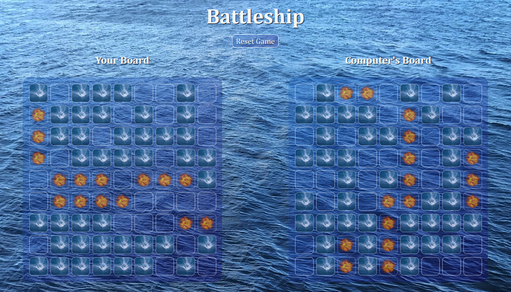

# Battleship

## Live Site
[Live Site](https://battleship-afink.netlify.app/)

## Goals
- Practice DOM manipulation and event handling with vanilla JS
- Practice Object Oriented Programming via classes for computer and player boards

## Features
- Battleship boards are randomly generated for the player and computer upon game start
- Computer makes a random move in response to each move made by the player
- Upon all ships being found by either player or computer a message is shown declaring the winner and all event listeners for the boards are removed
- Boards can be reset at any time with the reset button. New boards are randomly generated and the game begins again.

## Technologies Used
- HTML
- CSS
- JavaScript

## Ideal Future Improvements
- Add logic for computer to make targeted moves rather than picking randomly
- Improve responsiveness of design for smaller screens
- Add sounds to go along with miss / hit indicators
- Add a wins counter to keep track of wins / losses between games
